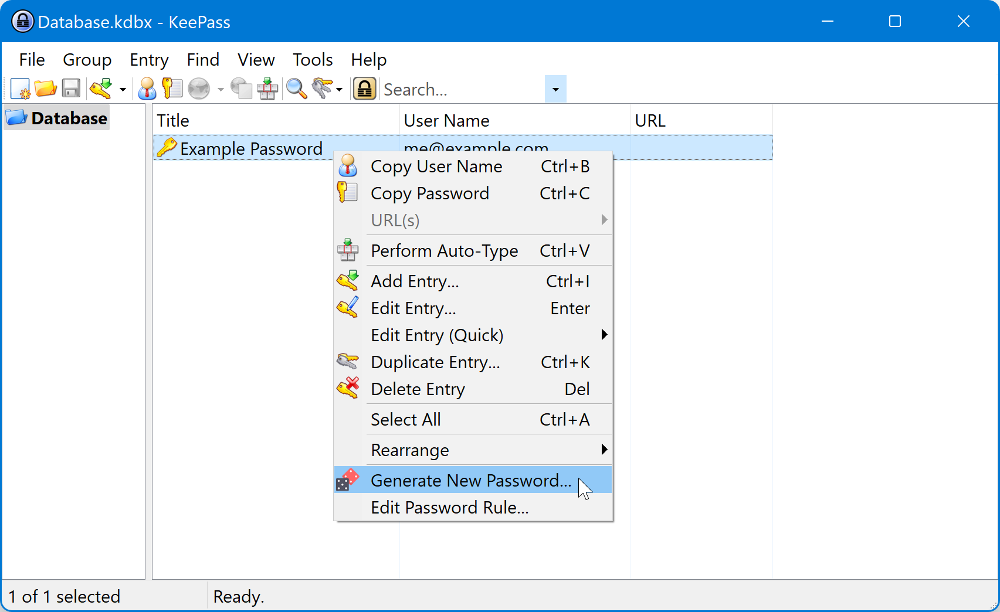

# KeePass Rule Builder
This is a plugin for the [KeePass 2](https://keepass.info/) password manager. With this plugin, you can use the KeePass database to keep track of all of the different requirements that websites have for account passwords, and easily generate new passwords according to those requirements.

The strongest passwords are randomly generated. However, some services unwisely place constraints on the passwords that you can use. A website may state that a password must be less than a certain length, or that it must contain certain types of characters, or that it must *not* contain certain other characters. To make matters worse, every website has different requirements, so changing passwords means reconfiguring your password generator every time.

The [password generator](https://keepass.info/help/base/pwgenerator.html) in KeePass helps with these challenges, but it can still be difficult to configure it to exactly meet the requirements of each service while keeping passwords as strong as possible.

The purpose of this plugin is to make it easy to tell KeePass how to generate a password for each service, and to streamline the process of changing passwords.

## Installation
To install this plugin, download the latest version from the [Releases](https://github.com/ihanson/KeePass-Rule-Builder/releases) page and copy it into your KeePass installation’s Plugins directory. See the [KeePass documentation](https://keepass.info/help/v2/plugins.html) for more help.

## How to use
### Changing a password
To change a password for an entry in KeePass, right-click the password entry and click **Generate New Password**.

The Change Password window will open. This window shows the current password as well as a new randomly generated password. Copy those passwords into the appropriate fields where you are setting the password. You can also use the hotkeys **Ctrl+Shift+Z** and **Ctrl+Shift+X** to auto-type the old and new passwords, respectively.

Once the password has been successfully changed, click **Accept** to store the new password into the KeePass database. Every time you change the password, the old password will be backed up in the entry’s [history](https://keepass.info/help/v2/entry.html#history).

### Password rules
By default, this tool will generate a new password based on the **Automatically generated passwords for new entries** profile in KeePass. You should [configure this profile](https://keepass.info/help/base/pwgenerator.html#configauto) to produce a very strong password. However, for services for which the passwords generated by this profile are [*too* strong](https://twitter.com/PWTooStrong), the plugin can help you generate a password according to each service’s individual password policy.

To specify the rules constraining your password, click the **Edit Rule** button from the Change Password window, or select **Edit Password Rule** from the entry context menu. In the Password Rule window, you can specify the rule in one of two ways.

#### Profile
You can select an existing KeePass profile—either one that is built into KeePass or a custom one that you have created. To choose this option, select **Profile** and choose the profile you want to use.

#### Rule
You can also build a password rule by providing a list of the character sets that may, must, or must not be used in the password. To enter a password rule in this way, select the **Rule** option in the Password Rule dialog.

Let’s say that a website requires passwords with the following properties:

- A password must be 8–20 characters long.
- A password must contain at least one letter.
- A password must contain at least one digit.
- A password may contain special characters, from the character set `!@#$%^&*()`.

As shown in the screenshot below, we will first enter a **Length** of *20*, the maximum password length. (There is no point in generating a password shorter than the maximum length.) Then click the **Add Character Set** button to add the built-in **Letters** and **Digits** character sets, and specify that both of them are **Required**. Click **Add Character Set** again to select a **Custom** character set, which you can then populate with the “special characters” listed in the password requirements.

Other options available in the Add Character Set menu are **All characters**, **Punctuation**, **Uppercase letters** and **Lowercase letters**. If the service for which you are generating a password requires that a password *not* contain certain characters, you can enter those into the **Exclude** field.

At the bottom of the Password Rule dialog, the **Example** line shows a sample password that follows the rule or profile that you have selected. (This is not the same password that will be set to the password entry when you save it.)

Once you have finished entering the password requirements, click **Accept**. If you were editing the rule from the Change Password window, a new password will automatically be generated using your new rule. Follow the steps above to save this password.

Any time you need to generate another password, just use the Generate New Password menu item. It will automatically use the rule that you have set for that entry.

---
Icons made by [Freepik](https://www.flaticon.com/authors/freepik "Freepik") from [www.flaticon.com](https://www.flaticon.com/ "Flaticon")